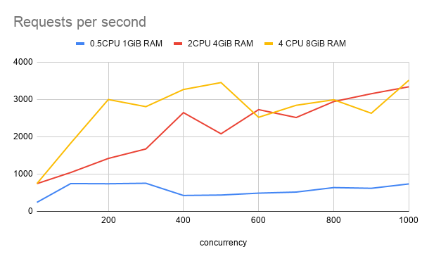

:toc: left
:toctitle: 目次
:sectnums:
:sectanchors:
:sectinks:
:chapter-label:
:source-highlighter: coderay

= R2DBCの負荷性能テスト

== テスト方法

* Spring WebFlux + Spring Data R2DBCでFargateのスペック（CPU）を変えた時の負荷性能を調べる。
* Fargateのスペックは以下の3パターンとする。
** 0.5CPU 1GiB RAM
** 2CPU 4GiB RAM
** 4CPU 8GiB RAM
* コンテナのメモリのハードリミットを1024MiBに設定する。
* RDBとしてRDSを使用する。スペックは以下の通り。
** Engine MySQL 8.0.20
** db.m5.xlarge 4vCPUs 16 GiB RAM EBS:4750 Mbps
* 測定対象は1つのテーブル（personテーブル）に対してSELECT文を発行し、結果を返す処理 `/select`
* personテーブルにはレコードが1件のみ
* 負荷ツールにはApache Benchを使う。
* Concurrencyを100〜1000まで変化させながら1000リクエストの負荷をかけた時のレスポンスの90パーセンタイル値を測定する。

* アプリケーションのソースコードは以下の通り。
** link:https://github.com/itoutki/webflux-sandbox/tree/master/webflux-r2dbc[]

== テスト結果

* 0.5vCPUの場合、CPUがボトルネックになり、レイテンシーが増大していく。
* 今回の実験は取得できるデータ件数が1件と少ないケースで実施したが、取得できるデータ件数による違いがあるかについては要検証。
* SELECT文以外（UPDATE、INSERT、DELETE）の場合についても要検証。

.Time per request
|===
| Concurrency | 0.5CPU 1GiB RAM | 2CPU 4GiB RAM | 4CPU 8GiB RAM

| 10 | 99 ms | 47 ms | 22 ms
| 100 | 204 ms | 170 ms | 106 ms
| 200 | 304 ms | 161 ms | 79 ms
| 300 | 687 ms | 166 ms | 92 ms
| 400 | 1203 ms | 136 ms | 94 ms
| 500 | 1596 ms | 182 ms | 129 ms
| 600 | 1544 ms | 267 ms | 118 ms
| 700 | 1329 ms | 290 ms | 269 ms
| 800 | 1371 ms | 251 ms | 232 ms
| 900 | 1259 ms | 262 ms | 251 ms
| 1000 | 1309 ms | 267 ms | 252 ms

|===

image:./../images/log/r2dbc-performance-cpu.png[]

.Request per second
|===
| Concurrency |0.5CPU 1GiB RAM |2CPU 4GiB RAM | 4 CPU 8GiB RAM

| 10 	| 242.31	| 743.97	| 745.57
| 100	| 746.09	| 1042.54	| 1829.89
| 200	| 740.91	| 1419.59	| 2998.51
| 300	| 754.48	| 1673.68	| 2807.16
| 400	| 426.94	| 2647.36	| 3266.99
| 500	| 438.81	| 2079.97	| 3452.81
| 600	| 489.44	| 2727.67	| 2522.19
| 700	| 518.3	    | 2516.38	| 2843.93
| 800	| 638.61	| 2943.54	| 2991.84
| 900	| 619.51	| 3154.03	| 2629.99
| 1000	| 736.75	| 3339.99	| 3516.17
|===

== FargateとCPUカウント

ECS on Fargateで0.5vCPU、1vCPUのタスクとしてアプリケーションを起動したとき、
Spring Boot ActuatorでCPUカウントが2と返ってくる。
CPU使用率についてもCPUカウントに基づいた値（0.5vCPUの場合、1/4）が返ってくる。
Cloudwatch Container Insightsで見ると、正しいCPU使用率になっている。

== Apache Benchの生ログ

=== 0.5 vCPU
==== 10

[source]
----
ab -c 10 -n 1000 http://10.0.0.215:8080/select

Server Software:
Server Hostname:        10.0.0.215
Server Port:            8080

Document Path:          /select
Document Length:        40 bytes

Concurrency Level:      10
Time taken for tests:   4.127 seconds
Complete requests:      1000
Failed requests:        0
Total transferred:      138000 bytes
HTML transferred:       40000 bytes
Requests per second:    242.31 [#/sec] (mean)
Time per request:       41.269 [ms] (mean)
Time per request:       4.127 [ms] (mean, across all concurrent requests)
Transfer rate:          32.66 [Kbytes/sec] received

Connection Times (ms)
              min  mean[+/-sd] median   max
Connect:        0    0   0.1      0       3
Processing:     1   41  47.5     10     281
Waiting:        1   38  44.0     10     203
Total:          2   41  47.5     10     281

Percentage of the requests served within a certain time (ms)
  50%     10
  66%     78
  75%     83
  80%     87
  90%     99
  95%    111
  98%    179
  99%    192
 100%    281 (longest request)

----

==== 100

[source]
----
ab -c 100 -n 1000 http://10.0.0.215:8080/select

Server Software:
Server Hostname:        10.0.0.215
Server Port:            8080

Document Path:          /select
Document Length:        40 bytes

Concurrency Level:      100
Time taken for tests:   1.340 seconds
Complete requests:      1000
Failed requests:        0
Total transferred:      138000 bytes
HTML transferred:       40000 bytes
Requests per second:    746.09 [#/sec] (mean)
Time per request:       134.032 [ms] (mean)
Time per request:       1.340 [ms] (mean, across all concurrent requests)
Transfer rate:          100.55 [Kbytes/sec] received

Connection Times (ms)
              min  mean[+/-sd] median   max
Connect:        0    1   0.7      1       4
Processing:     4  130  70.6    110     390
Waiting:        2  125  70.2    108     389
Total:          5  131  70.4    111     391

Percentage of the requests served within a certain time (ms)
  50%    111
  66%    173
  75%    184
  80%    189
  90%    204
  95%    288
  98%    302
  99%    308
 100%    391 (longest request)
----

==== 200

[source]
----
ab -c 200 -n 1000 http://10.0.0.215:8080/select

Server Software:
Server Hostname:        10.0.0.215
Server Port:            8080

Document Path:          /select
Document Length:        40 bytes

Concurrency Level:      200
Time taken for tests:   1.350 seconds
Complete requests:      1000
Failed requests:        0
Total transferred:      138000 bytes
HTML transferred:       40000 bytes
Requests per second:    740.91 [#/sec] (mean)
Time per request:       269.939 [ms] (mean)
Time per request:       1.350 [ms] (mean, across all concurrent requests)
Transfer rate:          99.85 [Kbytes/sec] received

Connection Times (ms)
              min  mean[+/-sd] median   max
Connect:        0    2   1.3      1       6
Processing:     6  194 105.2    192     587
Waiting:        2  187 104.6    187     585
Total:          6  195 105.0    192     588

Percentage of the requests served within a certain time (ms)
  50%    192
  66%    214
  75%    252
  80%    282
  90%    304
  95%    396
  98%    486
  99%    497
 100%    588 (longest request)

----

==== 300

[source]
----
ab -c 300 -n 1000 http://10.0.0.215:8080/select

Server Software:
Server Hostname:        10.0.0.215
Server Port:            8080

Document Path:          /select
Document Length:        40 bytes

Concurrency Level:      300
Time taken for tests:   1.325 seconds
Complete requests:      1000
Failed requests:        0
Total transferred:      138000 bytes
HTML transferred:       40000 bytes
Requests per second:    754.48 [#/sec] (mean)
Time per request:       397.627 [ms] (mean)
Time per request:       1.325 [ms] (mean, across all concurrent requests)
Transfer rate:          101.68 [Kbytes/sec] received

Connection Times (ms)
              min  mean[+/-sd] median   max
Connect:        0    3   2.2      2      14
Processing:     9  367 206.8    320     897
Waiting:        1  343 193.1    316     819
Total:          9  370 206.7    325     898

Percentage of the requests served within a certain time (ms)
  50%    325
  66%    474
  75%    501
  80%    508
  90%    687
  95%    791
  98%    801
  99%    892
 100%    898 (longest request)
----

==== 400

[source]
----
ab -c 400 -n 1000 http://10.0.0.215:8080/select

Server Software:
Server Hostname:        10.0.0.215
Server Port:            8080

Document Path:          /select
Document Length:        40 bytes

Concurrency Level:      400
Time taken for tests:   2.342 seconds
Complete requests:      1000
Failed requests:        0
Total transferred:      138000 bytes
HTML transferred:       40000 bytes
Requests per second:    426.94 [#/sec] (mean)
Time per request:       936.899 [ms] (mean)
Time per request:       2.342 [ms] (mean, across all concurrent requests)
Transfer rate:          57.54 [Kbytes/sec] received

Connection Times (ms)
              min  mean[+/-sd] median   max
Connect:        0   63 237.4      4    1025
Processing:    11  517 264.2    487    1330
Waiting:        2  485 258.5    445    1318
Total:         11  580 352.8    497    1631

Percentage of the requests served within a certain time (ms)
  50%    497
  66%    589
  75%    708
  80%    756
  90%   1203
  95%   1369
  98%   1609
  99%   1625
 100%   1631 (longest request)
----

==== 500

[source]
----
ab -c 500 -n 1000 http://10.0.0.215:8080/select

Server Software:
Server Hostname:        10.0.0.215
Server Port:            8080

Document Path:          /select
Document Length:        40 bytes

Concurrency Level:      500
Time taken for tests:   2.279 seconds
Complete requests:      1000
Failed requests:        0
Total transferred:      138000 bytes
HTML transferred:       40000 bytes
Requests per second:    438.81 [#/sec] (mean)
Time per request:       1139.451 [ms] (mean)
Time per request:       2.279 [ms] (mean, across all concurrent requests)
Transfer rate:          59.14 [Kbytes/sec] received

Connection Times (ms)
              min  mean[+/-sd] median   max
Connect:        0   43 193.2      7    1033
Processing:    14  755 454.9    676    1866
Waiting:        2  717 445.1    584    1786
Total:         15  798 483.0    690    2173

Percentage of the requests served within a certain time (ms)
  50%    690
  66%    792
  75%   1095
  80%   1199
  90%   1596
  95%   1871
  98%   1873
  99%   1904
 100%   2173 (longest request)
----

==== 600

[source]
----
ab -c 600 -n 1000 http://10.0.0.215:8080/select

Server Software:
Server Hostname:        10.0.0.215
Server Port:            8080

Document Path:          /select
Document Length:        40 bytes

Concurrency Level:      600
Time taken for tests:   2.043 seconds
Complete requests:      1000
Failed requests:        0
Total transferred:      138000 bytes
HTML transferred:       40000 bytes
Requests per second:    489.44 [#/sec] (mean)
Time per request:       1225.880 [ms] (mean)
Time per request:       2.043 [ms] (mean, across all concurrent requests)
Transfer rate:          65.96 [Kbytes/sec] received

Connection Times (ms)
              min  mean[+/-sd] median   max
Connect:        0   16  96.1      9    1023
Processing:    16  792 466.8    733    2021
Waiting:        2  740 458.4    694    2021
Total:         16  807 473.1    744    2032

Percentage of the requests served within a certain time (ms)
  50%    744
  66%    905
  75%   1106
  80%   1199
  90%   1544
  95%   1836
  98%   1945
  99%   1947
 100%   2032 (longest request)
----

==== 700

[source]
----
ab -c 700 -n 1000 http://10.0.0.215:8080/select

Server Software:
Server Hostname:        10.0.0.215
Server Port:            8080

Document Path:          /select
Document Length:        40 bytes

Concurrency Level:      700
Time taken for tests:   1.929 seconds
Complete requests:      1000
Failed requests:        0
Total transferred:      138000 bytes
HTML transferred:       40000 bytes
Requests per second:    518.30 [#/sec] (mean)
Time per request:       1350.563 [ms] (mean)
Time per request:       1.929 [ms] (mean, across all concurrent requests)
Transfer rate:          69.85 [Kbytes/sec] received

Connection Times (ms)
              min  mean[+/-sd] median   max
Connect:        0    9   5.1     11      27
Processing:    21  795 419.8    798    1900
Waiting:        2  748 431.8    725    1898
Total:         21  804 422.2    807    1912

Percentage of the requests served within a certain time (ms)
  50%    807
  66%    910
  75%    932
  80%   1017
  90%   1329
  95%   1809
  98%   1910
  99%   1912
 100%   1912 (longest request)
----

==== 800

[source]
----
ab -c 800 -n 1000 http://10.0.0.215:8080/select

Server Software:
Server Hostname:        10.0.0.215
Server Port:            8080

Document Path:          /select
Document Length:        40 bytes

Concurrency Level:      800
Time taken for tests:   1.566 seconds
Complete requests:      1000
Failed requests:        0
Total transferred:      138000 bytes
HTML transferred:       40000 bytes
Requests per second:    638.61 [#/sec] (mean)
Time per request:       1252.730 [ms] (mean)
Time per request:       1.566 [ms] (mean, across all concurrent requests)
Transfer rate:          86.06 [Kbytes/sec] received

Connection Times (ms)
              min  mean[+/-sd] median   max
Connect:        0   14   7.4     13      45
Processing:    19  796 400.3    675    1531
Waiting:        2  752 410.8    656    1466
Total:         19  811 404.7    686    1552

Percentage of the requests served within a certain time (ms)
  50%    686
  66%   1075
  75%   1159
  80%   1165
  90%   1371
  95%   1486
  98%   1550
  99%   1551
 100%   1552 (longest request)
----

==== 900

[source]
----
ab -c 900 -n 1000 http://10.0.0.215:8080/select

Server Software:
Server Hostname:        10.0.0.215
Server Port:            8080

Document Path:          /select
Document Length:        40 bytes

Concurrency Level:      900
Time taken for tests:   1.614 seconds
Complete requests:      1000
Failed requests:        0
Total transferred:      138000 bytes
HTML transferred:       40000 bytes
Requests per second:    619.51 [#/sec] (mean)
Time per request:       1452.753 [ms] (mean)
Time per request:       1.614 [ms] (mean, across all concurrent requests)
Transfer rate:          83.49 [Kbytes/sec] received

Connection Times (ms)
              min  mean[+/-sd] median   max
Connect:        0   13   4.7     15      18
Processing:    20  786 333.1    839    1579
Waiting:        2  728 355.8    750    1578
Total:         20  799 333.6    854    1595

Percentage of the requests served within a certain time (ms)
  50%    854
  66%    943
  75%   1066
  80%   1140
  90%   1259
  95%   1355
  98%   1356
  99%   1592
 100%   1595 (longest request)

----

==== 1000

[source]
----
ab -c 1000 -n 1000 http://10.0.0.215:8080/select

Server Software:
Server Hostname:        10.0.0.215
Server Port:            8080

Document Path:          /select
Document Length:        40 bytes

Concurrency Level:      1000
Time taken for tests:   1.357 seconds
Complete requests:      1000
Failed requests:        0
Total transferred:      138000 bytes
HTML transferred:       40000 bytes
Requests per second:    736.75 [#/sec] (mean)
Time per request:       1357.319 [ms] (mean)
Time per request:       1.357 [ms] (mean, across all concurrent requests)
Transfer rate:          99.29 [Kbytes/sec] received

Connection Times (ms)
              min  mean[+/-sd] median   max
Connect:        0   17   2.4     16      21
Processing:    22  775 364.6    807    1327
Waiting:        1  741 363.9    727    1325
Total:         29  792 363.0    825    1341

Percentage of the requests served within a certain time (ms)
  50%    825
  66%    918
  75%   1114
  80%   1133
  90%   1309
  95%   1321
  98%   1337
  99%   1339
 100%   1341 (longest request)

----

=== 2 vCPU

==== 10

[source]
----
ab -c 10 -n 1000 http://10.0.0.9:8080/select

Server Software:
Server Hostname:        10.0.0.9
Server Port:            8080

Document Path:          /select
Document Length:        40 bytes

Concurrency Level:      10
Time taken for tests:   1.344 seconds
Complete requests:      1000
Failed requests:        0
Total transferred:      138000 bytes
HTML transferred:       40000 bytes
Requests per second:    743.97 [#/sec] (mean)
Time per request:       13.441 [ms] (mean)
Time per request:       1.344 [ms] (mean, across all concurrent requests)
Transfer rate:          100.26 [Kbytes/sec] received

Connection Times (ms)
              min  mean[+/-sd] median   max
Connect:        0    0   0.2      0       4
Processing:     2   13  15.1      7      71
Waiting:        1   12  14.8      7      65
Total:          2   13  15.1      7      71

Percentage of the requests served within a certain time (ms)
  50%      7
  66%     10
  75%     12
  80%     14
  90%     47
  95%     51
  98%     57
  99%     60
 100%     71 (longest request)
----

==== 100

[source]
----
ab -c 100 -n 1000 http://10.0.0.9:8080/select

Server Software:
Server Hostname:        10.0.0.9
Server Port:            8080

Document Path:          /select
Document Length:        40 bytes

Concurrency Level:      100
Time taken for tests:   0.959 seconds
Complete requests:      1000
Failed requests:        0
Total transferred:      138000 bytes
HTML transferred:       40000 bytes
Requests per second:    1042.54 [#/sec] (mean)
Time per request:       95.920 [ms] (mean)
Time per request:       0.959 [ms] (mean, across all concurrent requests)
Transfer rate:          140.50 [Kbytes/sec] received

Connection Times (ms)
              min  mean[+/-sd] median   max
Connect:        0    1   1.0      1       6
Processing:     2   92  58.0     90     316
Waiting:        2   88  55.7     85     313
Total:          3   93  57.9     92     316

Percentage of the requests served within a certain time (ms)
  50%     92
  66%    104
  75%    124
  80%    149
  90%    170
  95%    192
  98%    223
  99%    285
 100%    316 (longest request)
----

==== 200

[source]
----
ab -c 200 -n 1000 http://10.0.0.9:8080/select

Server Software:
Server Hostname:        10.0.0.9
Server Port:            8080

Document Path:          /select
Document Length:        40 bytes

Concurrency Level:      200
Time taken for tests:   0.704 seconds
Complete requests:      1000
Failed requests:        0
Total transferred:      138000 bytes
HTML transferred:       40000 bytes
Requests per second:    1419.59 [#/sec] (mean)
Time per request:       140.886 [ms] (mean)
Time per request:       0.704 [ms] (mean, across all concurrent requests)
Transfer rate:          191.31 [Kbytes/sec] received

Connection Times (ms)
              min  mean[+/-sd] median   max
Connect:        0    2   1.4      1       7
Processing:     6  100  45.2    100     328
Waiting:        2   97  44.9     98     327
Total:          7  101  45.2    101     329

Percentage of the requests served within a certain time (ms)
  50%    101
  66%    117
  75%    127
  80%    135
  90%    161
  95%    173
  98%    212
  99%    218
 100%    329 (longest request)
----

==== 300

[source]
----
ab -c 300 -n 1000 http://10.0.0.9:8080/select

Server Software:
Server Hostname:        10.0.0.9
Server Port:            8080

Document Path:          /select
Document Length:        40 bytes

Concurrency Level:      300
Time taken for tests:   0.597 seconds
Complete requests:      1000
Failed requests:        0
Total transferred:      138000 bytes
HTML transferred:       40000 bytes
Requests per second:    1673.68 [#/sec] (mean)
Time per request:       179.246 [ms] (mean)
Time per request:       0.597 [ms] (mean, across all concurrent requests)
Transfer rate:          225.55 [Kbytes/sec] received

Connection Times (ms)
              min  mean[+/-sd] median   max
Connect:        0    4   3.7      4      15
Processing:     9  102  68.9     94     390
Waiting:        2   99  66.8     90     389
Total:          9  107  68.5     96     396

Percentage of the requests served within a certain time (ms)
  50%     96
  66%    111
  75%    127
  80%    143
  90%    166
  95%    209
  98%    382
  99%    395
 100%    396 (longest request)
----

==== 400

[source]
----
ab -c 400 -n 1000 http://10.0.0.9:8080/select

Server Software:
Server Hostname:        10.0.0.9
Server Port:            8080

Document Path:          /select
Document Length:        40 bytes

Concurrency Level:      400
Time taken for tests:   0.378 seconds
Complete requests:      1000
Failed requests:        0
Total transferred:      138000 bytes
HTML transferred:       40000 bytes
Requests per second:    2647.36 [#/sec] (mean)
Time per request:       151.094 [ms] (mean)
Time per request:       0.378 [ms] (mean, across all concurrent requests)
Transfer rate:          356.77 [Kbytes/sec] received

Connection Times (ms)
              min  mean[+/-sd] median   max
Connect:        0    4   2.5      5      15
Processing:     9   82  59.5     69     343
Waiting:        2   79  57.2     67     342
Total:         10   86  60.2     74     350

Percentage of the requests served within a certain time (ms)
  50%     74
  66%     90
  75%     96
  80%    103
  90%    136
  95%    263
  98%    326
  99%    339
 100%    350 (longest request)
----

==== 500

[source]
----
ab -c 500 -n 1000 http://10.0.0.9:8080/select

Server Software:
Server Hostname:        10.0.0.9
Server Port:            8080

Document Path:          /select
Document Length:        40 bytes

Concurrency Level:      500
Time taken for tests:   0.481 seconds
Complete requests:      1000
Failed requests:        0
Total transferred:      138000 bytes
HTML transferred:       40000 bytes
Requests per second:    2079.97 [#/sec] (mean)
Time per request:       240.388 [ms] (mean)
Time per request:       0.481 [ms] (mean, across all concurrent requests)
Transfer rate:          280.31 [Kbytes/sec] received

Connection Times (ms)
              min  mean[+/-sd] median   max
Connect:        0    7   2.8      8      19
Processing:     8  115 100.3     90     454
Waiting:        2  111 100.9     86     454
Total:          9  122 100.6     94     465

Percentage of the requests served within a certain time (ms)
  50%     94
  66%    104
  75%    115
  80%    121
  90%    182
  95%    441
  98%    458
  99%    461
 100%    465 (longest request)
----

==== 600

[source]
----
ab -c 600 -n 1000 http://10.0.0.9:8080/select

Server Software:
Server Hostname:        10.0.0.9
Server Port:            8080

Document Path:          /select
Document Length:        40 bytes

Concurrency Level:      600
Time taken for tests:   0.367 seconds
Complete requests:      1000
Failed requests:        0
Total transferred:      138000 bytes
HTML transferred:       40000 bytes
Requests per second:    2727.67 [#/sec] (mean)
Time per request:       219.968 [ms] (mean)
Time per request:       0.367 [ms] (mean, across all concurrent requests)
Transfer rate:          367.60 [Kbytes/sec] received

Connection Times (ms)
              min  mean[+/-sd] median   max
Connect:        0    8   4.3      9      28
Processing:    15  139  84.8    119     345
Waiting:        2  134  84.7    113     343
Total:         17  147  85.0    127     354

Percentage of the requests served within a certain time (ms)
  50%    127
  66%    158
  75%    194
  80%    205
  90%    267
  95%    345
  98%    352
  99%    353
 100%    354 (longest request)
----

==== 700

[source]
----
ab -c 700 -n 1000 http://10.0.0.9:8080/select

Server Software:
Server Hostname:        10.0.0.9
Server Port:            8080

Document Path:          /select
Document Length:        40 bytes

Concurrency Level:      700
Time taken for tests:   0.397 seconds
Complete requests:      1000
Failed requests:        0
Total transferred:      138000 bytes
HTML transferred:       40000 bytes
Requests per second:    2516.38 [#/sec] (mean)
Time per request:       278.177 [ms] (mean)
Time per request:       0.397 [ms] (mean, across all concurrent requests)
Transfer rate:          339.12 [Kbytes/sec] received

Connection Times (ms)
              min  mean[+/-sd] median   max
Connect:        0   23  14.2     14      53
Processing:    17  119  80.1     84     288
Waiting:        2  118  80.1     84     287
Total:         18  142  80.0    114     307

Percentage of the requests served within a certain time (ms)
  50%    114
  66%    126
  75%    140
  80%    239
  90%    290
  95%    293
  98%    299
  99%    300
 100%    307 (longest request)
----

==== 800

[source]
----
ab -c 800 -n 1000 http://10.0.0.9:8080/select

Server Software:
Server Hostname:        10.0.0.9
Server Port:            8080

Document Path:          /select
Document Length:        40 bytes

Concurrency Level:      800
Time taken for tests:   0.340 seconds
Complete requests:      1000
Failed requests:        0
Total transferred:      138000 bytes
HTML transferred:       40000 bytes
Requests per second:    2943.54 [#/sec] (mean)
Time per request:       271.782 [ms] (mean)
Time per request:       0.340 [ms] (mean, across all concurrent requests)
Transfer rate:          396.69 [Kbytes/sec] received

Connection Times (ms)
              min  mean[+/-sd] median   max
Connect:        0   15   5.4     14      40
Processing:    18  134  63.2    129     248
Waiting:        2  132  63.8    128     248
Total:         23  150  63.5    147     261

Percentage of the requests served within a certain time (ms)
  50%    147
  66%    161
  75%    177
  80%    232
  90%    251
  95%    255
  98%    258
  99%    259
 100%    261 (longest request)
----

==== 900

[source]
----
ab -c 900 -n 1000 http://10.0.0.9:8080/select

Server Software:
Server Hostname:        10.0.0.9
Server Port:            8080

Document Path:          /select
Document Length:        40 bytes

Concurrency Level:      900
Time taken for tests:   0.317 seconds
Complete requests:      1000
Failed requests:        0
Total transferred:      138000 bytes
HTML transferred:       40000 bytes
Requests per second:    3154.03 [#/sec] (mean)
Time per request:       285.349 [ms] (mean)
Time per request:       0.317 [ms] (mean, across all concurrent requests)
Transfer rate:          425.05 [Kbytes/sec] received

Connection Times (ms)
              min  mean[+/-sd] median   max
Connect:        0   14   4.6     14      32
Processing:    18  154  64.2    160     260
Waiting:        2  149  65.4    149     258
Total:         26  168  64.3    173     272

Percentage of the requests served within a certain time (ms)
  50%    173
  66%    189
  75%    230
  80%    235
  90%    262
  95%    268
  98%    270
  99%    271
 100%    272 (longest request)
----

==== 1000

[source]
----
ab -c 1000 -n 1000 http://10.0.0.9:8080/select

Server Software:
Server Hostname:        10.0.0.9
Server Port:            8080

Document Path:          /select
Document Length:        40 bytes

Concurrency Level:      1000
Time taken for tests:   0.299 seconds
Complete requests:      1000
Failed requests:        0
Total transferred:      138000 bytes
HTML transferred:       40000 bytes
Requests per second:    3339.99 [#/sec] (mean)
Time per request:       299.402 [ms] (mean)
Time per request:       0.299 [ms] (mean, across all concurrent requests)
Transfer rate:          450.12 [Kbytes/sec] received

Connection Times (ms)
              min  mean[+/-sd] median   max
Connect:        0   16   2.5     16      21
Processing:    20  156  64.9    136     261
Waiting:        2  153  65.5    130     261
Total:         29  173  63.4    152     277

Percentage of the requests served within a certain time (ms)
  50%    152
  66%    203
  75%    240
  80%    247
  90%    267
  95%    271
  98%    274
  99%    276
 100%    277 (longest request)
----

=== 4 vCPU

==== 10

[source]
----
ab -c 10 -n 1000 http://10.0.0.205:8080/

Server Software:
Server Hostname:        10.0.0.205
Server Port:            8080

Document Path:          /
Document Length:        27 bytes

Concurrency Level:      10
Time taken for tests:   1.341 seconds
Complete requests:      1000
Failed requests:        0
Total transferred:      98000 bytes
HTML transferred:       27000 bytes
Requests per second:    745.57 [#/sec] (mean)
Time per request:       13.413 [ms] (mean)
Time per request:       1.341 [ms] (mean, across all concurrent requests)
Transfer rate:          71.35 [Kbytes/sec] received

Connection Times (ms)
              min  mean[+/-sd] median   max
Connect:        0    0   0.0      0       1
Processing:     1   13   7.5     12      53
Waiting:        1   13   7.5     12      53
Total:          1   13   7.5     12      53

Percentage of the requests served within a certain time (ms)
  50%     12
  66%     15
  75%     17
  80%     19
  90%     22
  95%     27
  98%     34
  99%     39
 100%     53 (longest request)
----

==== 100

[source]
----
ab -c 100 -n 1000 http://10.0.0.205:8080/

Server Software:
Server Hostname:        10.0.0.205
Server Port:            8080

Document Path:          /
Document Length:        27 bytes

Concurrency Level:      100
Time taken for tests:   0.546 seconds
Complete requests:      1000
Failed requests:        0
Total transferred:      98000 bytes
HTML transferred:       27000 bytes
Requests per second:    1829.89 [#/sec] (mean)
Time per request:       54.648 [ms] (mean)
Time per request:       0.546 [ms] (mean, across all concurrent requests)
Transfer rate:          175.13 [Kbytes/sec] received

Connection Times (ms)
              min  mean[+/-sd] median   max
Connect:        0    0   0.5      0       4
Processing:     1   51  33.4     46     134
Waiting:        1   51  33.4     46     134
Total:          1   51  33.3     47     134

Percentage of the requests served within a certain time (ms)
  50%     47
  66%     59
  75%     68
  80%     80
  90%    106
  95%    118
  98%    124
  99%    128
 100%    134 (longest request)
----

==== 200

[source]
----
ab -c 200 -n 1000 http://10.0.0.205:8080/select

Server Software:
Server Hostname:        10.0.0.205
Server Port:            8080

Document Path:          /select
Document Length:        40 bytes

Concurrency Level:      200
Time taken for tests:   0.333 seconds
Complete requests:      1000
Failed requests:        0
Total transferred:      138000 bytes
HTML transferred:       40000 bytes
Requests per second:    2998.51 [#/sec] (mean)
Time per request:       66.700 [ms] (mean)
Time per request:       0.333 [ms] (mean, across all concurrent requests)
Transfer rate:          404.10 [Kbytes/sec] received

Connection Times (ms)
              min  mean[+/-sd] median   max
Connect:        0    2   1.6      2      10
Processing:     4   48  24.9     43     252
Waiting:        2   46  24.1     42     252
Total:          4   50  24.7     45     253

Percentage of the requests served within a certain time (ms)
  50%     45
  66%     54
  75%     60
  80%     67
  90%     79
  95%     93
  98%    113
  99%    122
 100%    253 (longest request)
----

==== 300

[source]
----
ab -c 300 -n 1000 http://10.0.0.205:8080/select

Server Software:
Server Hostname:        10.0.0.205
Server Port:            8080

Document Path:          /select
Document Length:        40 bytes

Concurrency Level:      300
Time taken for tests:   0.356 seconds
Complete requests:      1000
Failed requests:        0
Total transferred:      138000 bytes
HTML transferred:       40000 bytes
Requests per second:    2807.16 [#/sec] (mean)
Time per request:       106.870 [ms] (mean)
Time per request:       0.356 [ms] (mean, across all concurrent requests)
Transfer rate:          378.31 [Kbytes/sec] received

Connection Times (ms)
              min  mean[+/-sd] median   max
Connect:        0    5   2.6      5      13
Processing:     7   56  43.5     49     272
Waiting:        2   55  43.2     47     271
Total:          9   61  43.6     54     277

Percentage of the requests served within a certain time (ms)
  50%     54
  66%     69
  75%     73
  80%     83
  90%     92
  95%    105
  98%    242
  99%    273
 100%    277 (longest request)
----

==== 400

[source]
----
ab -c 400 -n 1000 http://10.0.0.205:8080/select

Server Software:
Server Hostname:        10.0.0.205
Server Port:            8080

Document Path:          /select
Document Length:        40 bytes

Concurrency Level:      400
Time taken for tests:   0.306 seconds
Complete requests:      1000
Failed requests:        0
Total transferred:      138000 bytes
HTML transferred:       40000 bytes
Requests per second:    3266.99 [#/sec] (mean)
Time per request:       122.437 [ms] (mean)
Time per request:       0.306 [ms] (mean, across all concurrent requests)
Transfer rate:          440.28 [Kbytes/sec] received

Connection Times (ms)
              min  mean[+/-sd] median   max
Connect:        0    6   2.5      6      15
Processing:     9   54  35.2     48     220
Waiting:        2   53  35.2     47     220
Total:         12   60  35.5     55     235

Percentage of the requests served within a certain time (ms)
  50%     55
  66%     66
  75%     69
  80%     79
  90%     94
  95%    112
  98%    223
  99%    224
 100%    235 (longest request)
----

==== 500

[source]
----
ab -c 500 -n 1000 http://10.0.0.205:8080/select

Server Software:
Server Hostname:        10.0.0.205
Server Port:            8080

Document Path:          /select
Document Length:        40 bytes

Concurrency Level:      500
Time taken for tests:   0.290 seconds
Complete requests:      1000
Failed requests:        0
Total transferred:      138000 bytes
HTML transferred:       40000 bytes
Requests per second:    3452.81 [#/sec] (mean)
Time per request:       144.810 [ms] (mean)
Time per request:       0.290 [ms] (mean, across all concurrent requests)
Transfer rate:          465.32 [Kbytes/sec] received

Connection Times (ms)
              min  mean[+/-sd] median   max
Connect:        0   11   5.1     10      25
Processing:    12   70  49.3     57     234
Waiting:        2   69  49.3     55     234
Total:         12   82  49.9     68     251

Percentage of the requests served within a certain time (ms)
  50%     68
  66%     92
  75%     97
  80%    105
  90%    129
  95%    237
  98%    243
  99%    249
 100%    251 (longest request)
----

==== 600

[source]
----
ab -c 600 -n 1000 http://10.0.0.205:8080/select

Server Software:
Server Hostname:        10.0.0.205
Server Port:            8080

Document Path:          /select
Document Length:        40 bytes

Concurrency Level:      600
Time taken for tests:   0.396 seconds
Complete requests:      1000
Failed requests:        0
Total transferred:      138000 bytes
HTML transferred:       40000 bytes
Requests per second:    2522.19 [#/sec] (mean)
Time per request:       237.889 [ms] (mean)
Time per request:       0.396 [ms] (mean, across all concurrent requests)
Transfer rate:          339.90 [Kbytes/sec] received

Connection Times (ms)
              min  mean[+/-sd] median   max
Connect:        0   15   7.5     12      33
Processing:    15   79  39.7     85     238
Waiting:        2   77  39.0     81     237
Total:         15   95  37.2     96     267

Percentage of the requests served within a certain time (ms)
  50%     96
  66%    105
  75%    111
  80%    114
  90%    118
  95%    120
  98%    242
  99%    243
 100%    267 (longest request)
----

==== 700

[source]
----
ab -c 700 -n 1000 http://10.0.0.205:8080/select

Server Software:
Server Hostname:        10.0.0.205
Server Port:            8080

Document Path:          /select
Document Length:        40 bytes

Concurrency Level:      700
Time taken for tests:   0.352 seconds
Complete requests:      1000
Failed requests:        0
Total transferred:      138000 bytes
HTML transferred:       40000 bytes
Requests per second:    2843.93 [#/sec] (mean)
Time per request:       246.138 [ms] (mean)
Time per request:       0.352 [ms] (mean, across all concurrent requests)
Transfer rate:          383.26 [Kbytes/sec] received

Connection Times (ms)
              min  mean[+/-sd] median   max
Connect:        0   13   2.8     13      24
Processing:    16  116  78.5     85     266
Waiting:        2  114  79.0     80     266
Total:         17  129  78.5     97     280

Percentage of the requests served within a certain time (ms)
  50%     97
  66%    128
  75%    182
  80%    243
  90%    269
  95%    276
  98%    278
  99%    280
 100%    280 (longest request)
----

==== 800

[source]
----
ab -c 800 -n 1000 http://10.0.0.205:8080/select

Server Software:
Server Hostname:        10.0.0.205
Server Port:            8080

Document Path:          /select
Document Length:        40 bytes

Concurrency Level:      800
Time taken for tests:   0.334 seconds
Complete requests:      1000
Failed requests:        0
Total transferred:      138000 bytes
HTML transferred:       40000 bytes
Requests per second:    2991.84 [#/sec] (mean)
Time per request:       267.394 [ms] (mean)
Time per request:       0.334 [ms] (mean, across all concurrent requests)
Transfer rate:          403.20 [Kbytes/sec] received

Connection Times (ms)
              min  mean[+/-sd] median   max
Connect:        0   12   4.2     13      30
Processing:    19  118  55.5    107     240
Waiting:        2  116  55.4    105     239
Total:         24  130  56.2    121     266

Percentage of the requests served within a certain time (ms)
  50%    121
  66%    156
  75%    173
  80%    176
  90%    232
  95%    248
  98%    251
  99%    252
 100%    266 (longest request)
----

==== 900

[source]
----
ab -c 900 -n 1000 http://10.0.0.205:8080/select

Server Software:
Server Hostname:        10.0.0.205
Server Port:            8080

Document Path:          /select
Document Length:        40 bytes

Concurrency Level:      900
Time taken for tests:   0.380 seconds
Complete requests:      1000
Failed requests:        0
Total transferred:      138000 bytes
HTML transferred:       40000 bytes
Requests per second:    2629.99 [#/sec] (mean)
Time per request:       342.207 [ms] (mean)
Time per request:       0.380 [ms] (mean, across all concurrent requests)
Transfer rate:          354.43 [Kbytes/sec] received

Connection Times (ms)
              min  mean[+/-sd] median   max
Connect:        0   14   4.5     15      37
Processing:    21  141  64.5    147     247
Waiting:        2  138  64.8    146     247
Total:         26  155  66.1    163     282

Percentage of the requests served within a certain time (ms)
  50%    163
  66%    186
  75%    193
  80%    217
  90%    251
  95%    259
  98%    263
  99%    263
 100%    282 (longest request)
----

==== 1000

[source]
----
ab -c 1000 -n 1000 http://10.0.0.205:8080/select

Server Software:
Server Hostname:        10.0.0.205
Server Port:            8080

Document Path:          /select
Document Length:        40 bytes

Concurrency Level:      1000
Time taken for tests:   0.284 seconds
Complete requests:      1000
Failed requests:        0
Total transferred:      138000 bytes
HTML transferred:       40000 bytes
Requests per second:    3516.17 [#/sec] (mean)
Time per request:       284.400 [ms] (mean)
Time per request:       0.284 [ms] (mean, across all concurrent requests)
Transfer rate:          473.86 [Kbytes/sec] received

Connection Times (ms)
              min  mean[+/-sd] median   max
Connect:        0   17   2.3     18      22
Processing:    23  165  62.7    186     253
Waiting:        2  158  61.4    172     252
Total:         29  182  61.6    206     267

Percentage of the requests served within a certain time (ms)
  50%    206
  66%    218
  75%    219
  80%    223
  90%    252
  95%    257
  98%    261
  99%    264
 100%    267 (longest request)
----

