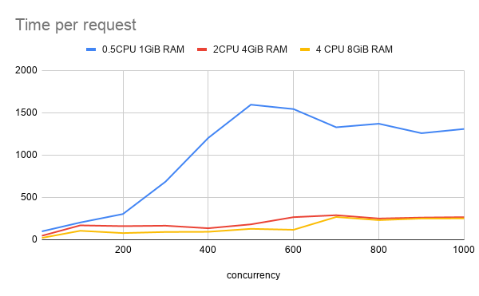

:toc: left
:toctitle: 目次
:sectnums:
:sectanchors:
:sectinks:
:chapter-label:
:source-highlighter: coderay

= R2DBCの負荷性能テスト

== テスト方法

* Spring WebFlux + Spring Data R2DBCでFargateのスペック（CPU）を変えた時の負荷性能を調べる。
* Fargateのスペックは以下の3パターンとする。
** 0.5CPU 1GiB RAM
** 2CPU 4GiB RAM
** 4CPU 8GiB RAM
* コンテナのメモリのハードリミットを1024MiBに設定する。
* RDBとしてRDSを使用する。スペックは以下の通り。
** Engine MySQL 8.0.20
** db.m5.xlarge 4vCPUs 16 GiB RAM EBS:4750 Mbps
* 負荷ツールにはApache Benchを使う。
* Concurrencyを100〜1000まで変化させながら1000リクエストの負荷をかけた時のレスポンスの90パーセンタイル値を測定する。

== テスト結果

|===
| Concurrency | 0.5CPU 1GiB RAM | 2CPU 4GiB RAM | 4CPU 8GiB RAM

| 10 | 99 ms | 47 ms | 22 ms
| 100 | 204 ms | 170 ms | 106 ms
| 200 | 304 ms | 161 ms | 79 ms
| 300 | 687 ms | 166 ms | 92 ms
| 400 | 1203 ms | 136 ms | 94 ms
| 500 | 1596 ms | 182 ms | 129 ms
| 600 | 1544 ms | 267 ms | 118 ms
| 700 | 1329 ms | 290 ms | 269 ms
| 800 | 1371 ms | 251 ms | 232 ms
| 900 | 1259 ms | 262 ms | 251 ms
| 1000 | 1309 ms | 267 ms | 252 ms

|===

