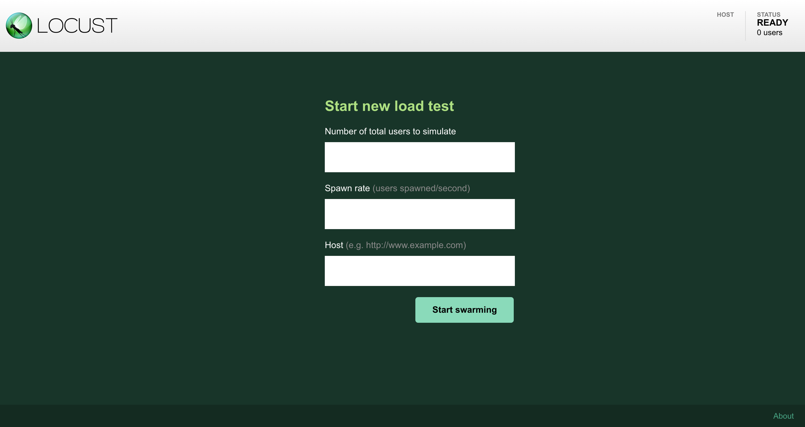
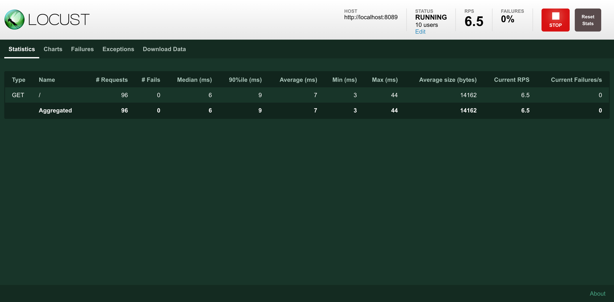
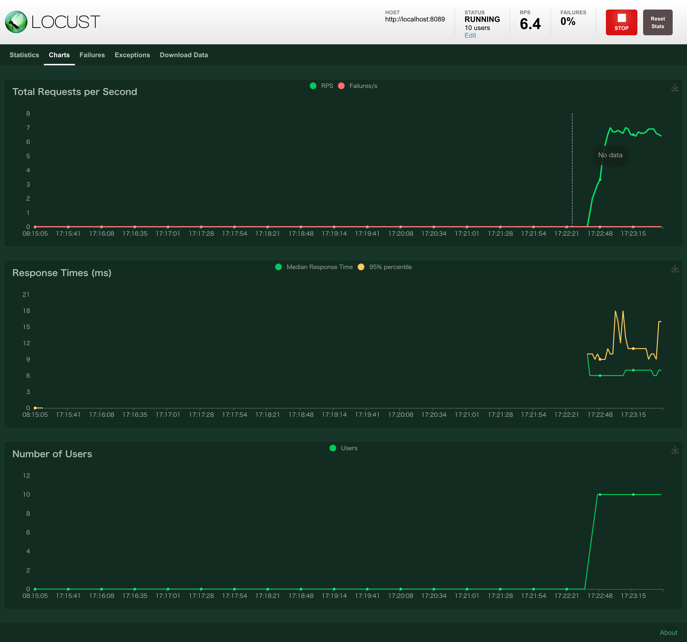

:toc: left
:toctitle: 目次
:sectnums:
:sectanchors:
:sectinks:
:chapter-label:
:source-highlighter: highlightjs

= 負荷テストツール Locust入門

== Locustとは

Pythonで実装された負荷テストツール。 +
負荷テストのシナリオをPythonのスクリプトとして書ける。 +
負荷テスト実行用のノード（workerノード）を複数起動して分散実行できる機能を備えており、大量の負荷をかけられる。 +
Web UIがあり、負荷テストの実行状況をグラフなどから確認できる。

ここでは執筆時点での最新版である1.4.3を前提にしている。

== Quick Start

Locustをインストール・起動する方法としては大きく2つある。

* Pythonのパッケージ管理ツールであるpipを使ってLocustをインストールし、コマンドとして起動する
* Dockerを使って起動する。

ここでは、環境構築が簡単なDockerを使って起動する方法について説明する。

=== 負荷テストのシナリオ作成

負荷テストのシナリオとして、以下の内容のlocustfile.pyを作成する。
ここでは、URL「/」に対して1秒ごとにGETリクエストを送信するシナリオを作成している。

[source, python]
----
import random
from locust import HttpUser, task, between

class QuickstartUser(HttpUser): # <1>
    wait_time = between(1, 1)   # <2>

    @task                       # <3>
    def index_page(self):
        self.client.get("/")    # <4>
----
<1> HttpUserクラスを継承したクラスを定義する。
<2> wait_time属性にテストシナリオの実行間隔を指定する。ここでは最小1秒・最大1秒として指定している。
<3> @taskデコレータを付与したメソッドを定義し、その中で実行したいシナリオを記述する。
<4> self.clientに設定されたHttpSessionのインスタンスを使用し、リクエスト処理を記述する。

=== 負荷テストの実行

以下のコマンドでLocustを起動する。ポイントとしては以下の4点。

* Web UIがポート8089で起動するため、ポート8089をホストポート8089で公開する（-p 8089:8089）
* 作成したlocustfile.pyをコンテナに渡すため、現在のディレクトリを「/mnt/locust」にマウントする（-v $PWD:/mnt/locust）
* コンテナイメージとして、locustio/locustを指定する
* locustの実行パラメータとして、作成した負荷シナリオのファイル名を渡す（-f /mnt/locust/locustfile.py）

[source, shellscript]
----
docker run --rm --name locust_test -p 8089:8089 -v $PWD:/mnt/locust locustio/locust:1.4.3 -f /mnt/locust/locustfile.py
----

ブラウザで「http://localhost:8089」にアクセスし、LocustのWeb UIを表示させる。

「Number of total users to simulate」に負荷シナリオを実行するユーザ数（≒同時実行数）を指定する。 +
「Spawn rate」に1秒あたりの実行ユーザ数の増加量を指定する。（例：5と指定すると1秒ごとに5ユーザずつ増えていく） +
「Host」に対象ホストを指定する。 +
「Start swarming」を押下すると負荷テストが開始される。 +
負荷テストが開始されると以下のような画面に切り替わる。

この画面では、各URLに対する負荷テストの統計情報（レスポンスの平均・最大・RPSなど）をリアルタイムに確認できる。 +
画面上部の「Charts」を選択すると、以下のようにRPS・レスポンスタイム・実行ユーザ数をグラフで確認できる。

== 参考

* link:https://locust.io/[Locust - A modern load testing framework]