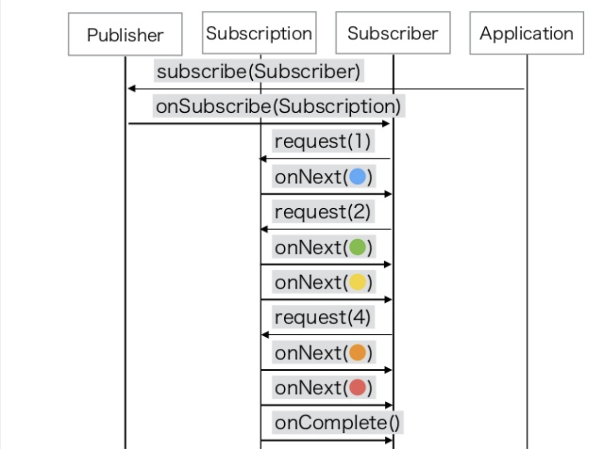

:toc: left
:toctitle: 目次
:sectnums:
:sectanchors:
:sectinks:
:chapter-label:
:source-highlighter: coderay

= メモ

== Reactive Streams

ノンブロッキングIOでバックプレッシャーを備えた非同期ストリーム処理の標準。 +
JVM向け、JS向けのインタフェース定義（reactive-streams-jvm、reactive-streams-js）、 +
およびネットワークプロトコル（reactive-streams-io）がある。 +

=== ノンブロッキングIOとブロッキングIO

ブロッキングIO::
read/writeを全て完了するまで、スレッドは次の処理に移ることはできない。

ノンブロッキングIO::
read/writeを全て完了していなくても、スレッドは次の処理に移ることができる。

=== 非同期処理と同期処理

同期処理::
処理が完了するまで次の処理に移ることができない。

非同期処理::
処理が完了したタイミングで通知され、通知があるまでは他の処理を進めることができる。

=== バック・プレッシャー

* データを受け取る側がデータを送る側に対して流量を制御できるようにするための仕組み。

=== reactive-streams-jvm

4つのインタフェースと各インタフェースが従うべき仕様が定義されている。

* Publisher
** データ提供者。
** 有限または無限の順序データを提供する。
** Subscriberを渡してデータ購読の開始処理を行うsubscribeメソッドを持つ。

.Publisher
[source, java]
----
public interface Publisher<T> {
    public void subscribe(Subscriber<? super T> s);
}
----

* Subscriber
** データ購読者。
** Publisherからデータを受け取り、何らかの処理を行う。
** Publisherから購読が開始されたタイミングでonSubscribeメソッドが呼ばれ、Subscriptionを受け取る。
** Publisherからデータを受け取るタイミングでonNextメソッドが呼ばれ、データを受け取る。
** Publisherの処理が完了したタイミングでonCompleteメソッドが呼ばれる。
** Publisherの処理でエラーが発生したタイミングでonErrorメソッドが呼ばれ、エラー情報（Throwable）を受け取る。

.Subscriber
[source, java]
----
public interface Subscriber<T> {
    public void onSubscribe(Subscription s);
    public void onNext(T t);
    public void onError(Throwable t);
    public void onComplete();
}
----

* Subscription
** PublisherからSubscriberに渡される購読のためのインタフェース。
** Subscriptionを通じてデータの要求（+受信可能なデータ件数の通知）や購読のキャンセルを行うことができる。
** Subscriberへの各種イベント発行（onSubscribeなど）はSubscriptionから行われる。

.Subscription
[source, java]
----
public interface Subscription {
    public void request(long n);
    public void cancel();
}
----

* Processor
** PublisherとSubscriberを両方実装したインタフェース。

.Processor
[source, java]
----
public interface Processor<T, R> extends Subscriber<T>, Publisher<R> {
}
----

※"Reactive Webアプリケーション - そしてSpring 5へ" p62より引用

== Lite Rx API Hands-On with Reactor Core 3

* link:https://github.com/itoutki/lite-rx-api-hands-on[itoutki/lite-rx-api-hands-on]

=== Part01 Flux

Reactor Coreの主要要素である、 Fluxの生成方法について。 +
そもそもFluxとは、Reactor CoreにおけるPublisherの実装の1つである。 +
0〜無限個のデータを提供する。 +
基本的にはFluxのstaticメソッドを使って生成する。

Flux.empty::
ただ完了するだけのFluxを生成する。 +
Reactive StreamsでいうところのonCompleteのみをSubscriberに通知する。

Flux.just::
引数で指定した値を返すFluxを生成する。

Flux.fromArray::
引数で指定した配列の内容を順に返すFluxを生成する。

Flux.error::
引数で指定した例外を返すFluxを生成する。 +
Reactive Streamsでいう所のonErrorで例外をSubscriberに通知する。

Flux.interval::
引数で指定した時間間隔ごとに0からLong型の値を順に返すFluxを生成する。 +
時間間隔のみを指定した場合、初回のデータ（0）は指定時間間隔後に返される。 +
初回データを返すタイミングを指定したい場合、初回データを返すまでの時間とその後の時間間隔を指定する。

Flux#take::
Fluxのインスタンスメソッド +
先頭から引数で指定した数のデータだけを返すFluxに変換する。

=== Part02 Mono

Reactor Coreの主要要素である、 Monoの生成方法について。 +
そもそもMonoとは、Reactor CoreにおけるPublisherの実装の1つである。 +
0〜1個のデータを提供する。 +
基本的にはMonoのstaticメソッドを使って生成する。

Mono.empty::
ただ完了するだけのMonoを生成する。 +
Reactive StreamsでいうところのonCompleteのみをSubscriberに通知する。

Mono.never::
何も通知しないMonoを生成する。 +
何も通知しないので、onCompleteも通知されない。

Mono.just::
引数で指定した値を返すMonoを生成する。 +
Flux.justと違い、引数で指定できる値は1つのみ。

Mono.error::
引数で指定した例外を返すMonoを生成する。 +
Reactive Streamsでいう所のonErrorで例外をSubscriberに通知する。

=== Part03 StepVerifier

FluxやMonoをテストするためのクラスであるStepVerifierの使い方について。 +
FluxやMonoを返すメソッドのユニットテストを行う場合には必須のクラスだと思われる。

==== よくある使い方

* StepVerifier.createもしくはStepVerifier.withVirtualTimeを使ってStepVerifierを生成する。
** StepVerifier.createの場合、Flux、Mono、もしくはPublisherの実装クラスを渡す。
** StepVerifier.withVirtualTimeの場合、Flux、Mono、もしくはPublisherの実装クラスを返すlambdaを渡す。
* expectNext、expectNextMatches、assertNext、expectNextCountなどを使ってFlux、Monoから返される値の検証を行う。
** expectNext : 値を指定する。複数個指定できる。
** expectNextMatches : 真偽値を返すlambda（Predicate）で値を検証する。
** assertNext : 値を返さないlambda（Consumer）で値を検証する。lambdaの中でassert文を使用する想定。
** expectNextCount : 値の中身ではなく、個数を検証する。
* verifyComplete、verifyErrorなどを使って最終状態（Complete or Error）が通知されたことを検証する。
* 時間のかかるFlux、Monoをテストする場合、withVirtualTimeを使って生成したStepVerifierに対してthenAwaitを使用することで時間経過をエミュレートできる。

=== Part04 Transform

=== Part05 Merge

=== Part06 Request

=== Part07 Errors

=== Part08 OtherOperations

=== Part09 Adapt

=== Part10 ReactiveToBlocking

=== Part11 BlockingToReactive

== WebFluxメモ

link:https://github.com/itoutki/webflux-sandbox[itoutki/webflux-sandbox]

* Spring Initializrを使ってwebfluxのプロジェクト雛形を作る
** link:https://blog.ik.am/entries/417[BLOG.IK.AM]
** link:https://reasonable-code.com/curl-spring-initializr/[curlでSpring Initializrを使ったプロジェクトを作成する方法 - Reasonable Code]

[source, shell]
----
curl https://start.spring.io/starter.tgz \
       -d bootVersion=2.3.0.BUILD-SNAPSHOT \
       -d artifactId=webflux-sandbox \
       -d baseDir=webflux-sandbox \
       -d javaVersion=14 \
       -d dependencies=webflux \
       -d applicationName=SandboxApplication | tar -xzvf -
----

* Fluxで徐々に値が返るようにするには
** Server-Sent Eventまたはjson streamとして返すようにする
** レスポンスヘッダに"Content-Type: text/event-stream;"を付与する
** link:https://speakerdeck.com/shintanimoto/introduction-to-reactive-programming-using-spring-webflux?slide=29[業務で使いたいWebFluxによるReactiveプログラミング / Introduction to Reactive Programming using Spring WebFlux - Speaker Deck]

* Server-Sent Eventとjson streamの違い
** Server-Sent Eventの場合、Fluxのデータをdata:xxxの形で1つずつ受け取る
** json streamの場合、Fluxのデータをjsonオブジェクトとして1つずつ受け取る
** レスポンスの内容がjsonでない場合、json streamでは1つずつ受け取ることができず、まとめて受け取る
***（application/jsonと同じ挙動）

* POSTでエラーが出る
** POSTリクエストを送信するときに、Content-Typeを指定しないとapplication/x-www-form-urlencodedになる
** WebFluxの場合、application/x-www-form-urlencodedのときに、@RequestBodyでリクエストボディを受け取れない
*** In a WebFlux application, form data is accessed via ServerWebExchange.getFormData().
** 'Content-Type: application/json'を明示的に指定することで受け取れるようになる

* curlからのテストの仕方

[source, shell]
----
# Server-Sent Event
curl -v -H 'Accept: text/event-stream;' http://localhost:8080/
curl -v -H 'Accept: text/event-stream;' http://localhost:8080/texts
curl -v -H 'Accept: text/event-stream;' http://localhost:8080/delayedtexts
curl -v -H 'Accept: text/event-stream;' http://localhost:8080/messages
curl -v -H 'Accept: text/event-stream;' http://localhost:8080/delayedmessages

# json stream
curl -v -H 'Accept: application/stream+json;' http://localhost:8080/
curl -v -H 'Accept: application/stream+json;' http://localhost:8080/messages
curl -v -H 'Accept: application/stream+json;' http://localhost:8080/delayedmessages
curl -v -H 'Accept: application/stream+json;' http://localhost:8080/texts
curl -v -H 'Accept: application/stream+json;' http://localhost:8080/delayedtexts

# POST + json stream (エラーになるケース)
curl -v -H 'Accept: application/stream+json;' http://localhost:8080/echo -d 'hoge'

# POST + json stream（正常に動くケース）
curl -v -H 'Content-Type: application/json' -H 'Accept: application/stream+json;' http://localhost:8080/echo -d 'hoge'
----

* Flux.intervalを使って徐々に値を返すようにするパターン

[source, java]
----

// zipWith と map を組み合わせるパターン
// zipWith によって Flux<Tuple2> に変換されるので Tuple2 から値を取り出すために map を組み合わせる
Flux.just(new Message("Hello"), new Message("World!"))
    .zipWith(Flux.interval(Duration.ofSeconds(1L)))
    .map(T -> T.getT1());

// zipWith の第二引数にlambdaを指定することで上記と同等の処理を行う
Flux.just(new Message("Hello"), new Message("World!"))
    .zipWith(Flux.interval(Duration.ofSeconds(1L)), (msg, c) -> msg);
----

* link:https://projectreactor.io/docs/netty/snapshot/reference/index.html[Reactor Netty Reference Guide]

* link:https://github.com/spring-projects/spring-boot/blob/master/spring-boot-project/spring-boot-docs/src/main/java/org/springframework/boot/docs/web/reactive/function/client/ReactorNettyClientCustomizationExample.java[spring-boot/ReactorNettyClientCustomizationExample.java at master · spring-projects/spring-boot]

== Spring WebFlux WebClient

* 検証項目
** GET
** POST
** Header
** Cookie
** HTTPS
** event stream、stream json形式のAPIからの取得（GET・POST）
** 直列実行
** 並列実行
** リトライ
** キャッシュ
** エラーハンドリング
*** ステータスコードごとのハンドリング
*** タイムアウト時のハンドリング
*** エラーハンドリングとリトライの組み合わせ
** 通信タイムアウト
** テスト

=== GETリクエスト

* 通常のGET
* クエリストリング

[source, java]
----

// Mono(String) API -> bodyToMono OK
@GetMapping("/gettext")
public Mono<String> getText() {
    return webClient.get()
            .uri("http://localhost:8080/text")
            .retrieve()
            .bodyToMono(String.class);
}

// Mono(object) API -> bodyToMono OK
@GetMapping("/getmessagemono")
public Mono<Message> getMessageMono() {
    return webClient.get()
            .uri("http://localhost:8080/message")
            .retrieve()
            .bodyToMono(Message.class);
}

// Mono(object) API -> bodyToFlux OK
@GetMapping("/getmessageflux")
public Flux<Message> getMessageFlux() {
    return webClient.get()
            .uri("http://localhost:8080/message")
            .retrieve()
            .bodyToFlux(Message.class);
}

// Flux(array) API  -> bodyToMono NG
// array型のレスポンスをMessageオブジェクトに変換できないため
@GetMapping("/getmessagesmono")
public Mono<Message> getMessagesMono() {
    return webClient.get()
            .uri("http://localhost:8080/messages")
            .retrieve()
            .bodyToMono(Message.class);
}

// Flux(array) API  -> bodyToMono
// ParameterizedTypeReferenceを使うことで無理やり実現することはできる
// ただし返ってくるのはMessage型ではなくList<Message>型
@GetMapping("/getmessagesmono")
public Mono<ArrayList<Message>> getMessagesMono() {
    return webClient.get()
            .uri("http://localhost:8080/messages")
            .retrieve()
            .bodyToMono(new ParameterizedTypeReference<ArrayList<Message>>() {});
}

// Flux(array) API  -> bodyToFlux OK
@GetMapping("/getmessagesflux")
public Flux<Message> getMessagesFlux() {
    return webClient.get()
            .uri("http://localhost:8080/messages")
            .retrieve()
            .bodyToFlux(Message.class);
}
----

== GitHub ActionsでasciidocからGitHub Pagesを生成

[source, yaml]
----
# This is a basic workflow to help you get started with Actions

name: CI

# Controls when the action will run. Triggers the workflow on push or pull request
# events but only for the master branch
on:
  push:
    branches: [ master ]
  pull_request:
    branches: [ master ]

# A workflow run is made up of one or more jobs that can run sequentially or in parallel
jobs:
  # This workflow contains a single job called "build"
  build:
    # The type of runner that the job will run on
    runs-on: ubuntu-latest

    # Steps represent a sequence of tasks that will be executed as part of the job
    steps:
    # Checks-out your repository under $GITHUB_WORKSPACE, so your job can access it
    - uses: actions/checkout@v2

    # Runs a single command using the runners shell
    - name: Run asciidoctor
      uses: Analog-inc/asciidoctor-action@master
      with:
        shellCommand: "asciidoctor doc/*.adoc -D out"
    
    - name: Copy resources
      run: |
        sudo cp -r doc/images out/
    
    - name: Publish gh-pages
      uses: peaceiris/actions-gh-pages@v3
      with:
        github_token: ${{ secrets.GITHUB_TOKEN }}
        publish_dir: out
----

== parking lot

** WebClientで自己証明書のHTTPS通信をできるようにする
*** link:https://gist.github.com/rstoyanchev/83956714c5312a10dfbe9866f3f6d85d[WebClient with SSL]

[source, java]
----
SslContext sslContext = SslContextBuilder
        .forClient().trustManager(InsecureTrustManagerFactory.INSTANCE)
        .build();
HttpClient httpClient = HttpClient.create()
        .secure(sslContextSpec -> sslContextSpec.sslContext(sslContext));
ClientHttpConnector connector = new ReactorClientHttpConnector(httpClient);
WebClient webClient = WebClient.builder().clientConnector(connector).build();

return webClient.get()
        .uri("https://localhost:8444/users")
        .retrieve()
        .bodyToFlux(String.class)
        .log()
        .zipWith(Flux.interval(Duration.ofSeconds(3)))
        .map(T -> "{\"data\": \"" + T.getT1() + "\"}");
----

* WebClientのbodyToMonoでMismatchedInputExceptionが発生する場合の対処
** 原因
*** bodyToMonoではjacksonを使ってjsonからJavaオブジェクトにデシリアライズする
*** jacksonでデシリアライズする場合、デフォルトコンストラクタまたは`@JsonCreator`を指定したコンストラクタまたはファクトリメソッドが必要
*** link:https://github.com/FasterXML/jackson-databind#annotations-using-custom-constructor[FasterXML/jackson-databind: General data-binding package for Jackson (2.x): works on streaming API (core) implementation(s)]

* Fluxを返すAPIにおける、コンテンツタイプごとのレスポンスフォーマットの違い
** application/jsonの場合
*** array形式
*** 全てのデータがまとめて返ってくる
** text/event-streamの場合
*** data:XXXの形式
*** データは1つずつ返ってくる
** application/stream+jsonの場合
*** 個々のjson形式
*** データは1つずつ返ってくる

[source, shell]
----
$ curl -v -H 'Accept: application/json;' http://localhost:8080/messages
[{"message":"Hello"},{"message":"World!"}]

$ curl -v -H 'Accept: text/event-stream;' http://localhost:8080/messages
data:{"message":"Hello"}

data:{"message":"World!"}

$ curl -v -H 'Accept: application/stream+json;' http://localhost:8080/messages
{"message":"Hello"}
{"message":"World!"}

----

=== マイクロサービスのサンプル実装

* ECサイト
* フリマサイト
* チャット
* プロジェクト管理ツール
* 個人間送金アプリ
* ツアー予約システム

